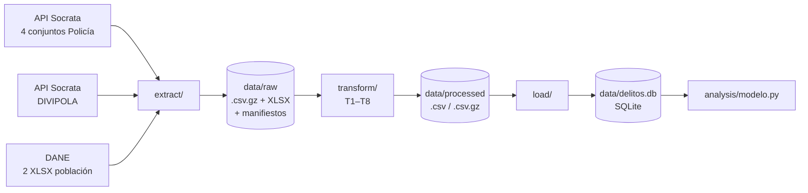
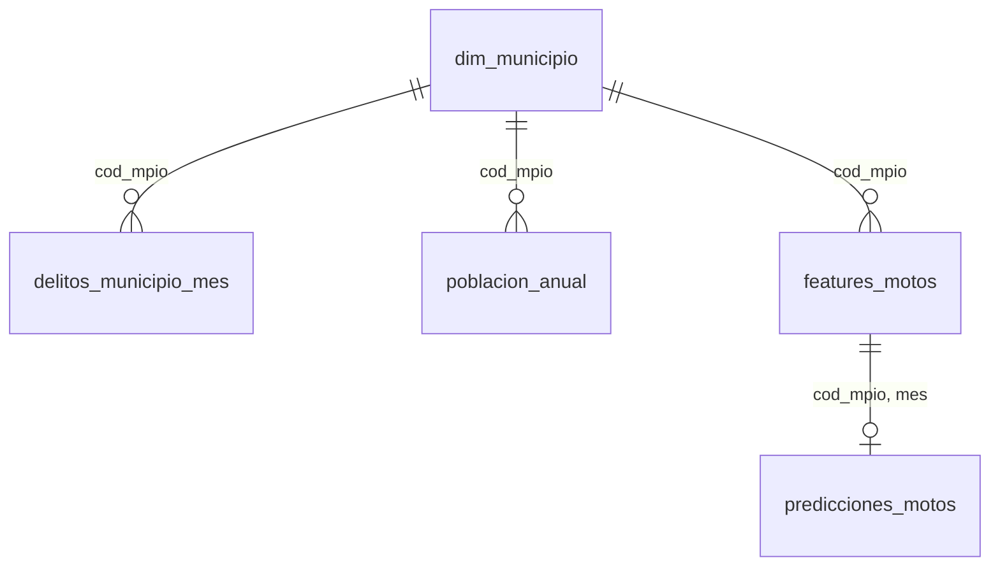
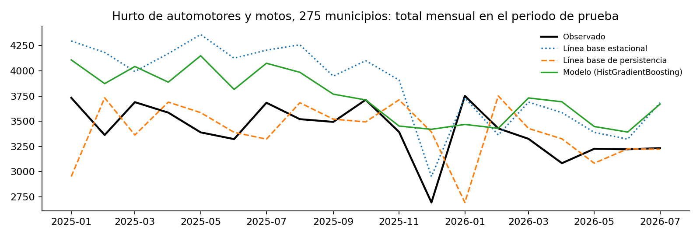

# Pronóstico mensual de delitos de impacto por municipio en Colombia

> Pipeline ETL que extrae los registros delictivos de la Policía Nacional, la codificación territorial DIVIPOLA y las proyecciones de población del DANE; los une, homologa y corrige; y carga en SQLite un panel municipio-mes listo para pronosticar el hurto de automotores y motocicletas.

**Curso:** ETL — Maestría en Inteligencia Artificial y Ciencia de Datos, Universidad Autónoma de Occidente
**Periodo:** 2026-2
**Docente:** Fernando Barraza Alvarado
**Línea:** Ciencia de Datos e IA

## Integrantes

| Nombre | Código | Usuario de GitHub |
|---|---|---|
| Steven Fierro Jaramillo | [pendiente] | [pendiente] |
| Sahin Pérez Caipe | [pendiente] | [pendiente] |
| David Santiago Samboni | [pendiente] | [pendiente] |

## Tabla de contenido

1. [Descripción del problema](#1-descripción-del-problema)
2. [Fuentes de datos](#2-fuentes-de-datos)
3. [Arquitectura del pipeline](#3-arquitectura-del-pipeline)
4. [Estructura del repositorio](#4-estructura-del-repositorio)
5. [Requisitos](#5-requisitos)
6. [Instalación y configuración](#6-instalación-y-configuración)
7. [Ejecución](#7-ejecución)
8. [Detalle de las etapas ETL](#8-detalle-de-las-etapas-etl)
9. [Modelo y diccionario de datos](#9-modelo-y-diccionario-de-datos)
10. [Calidad de datos y validaciones](#10-calidad-de-datos-y-validaciones)
11. [Resultados](#11-resultados)
12. [Limitaciones y trabajo futuro](#12-limitaciones-y-trabajo-futuro)
13. [Referencias](#13-referencias)

## 1. Descripción del problema

La Policía Nacional publica en datos.gov.co los registros de los delitos de impacto por municipio y fecha, pero esas cifras se usan de forma retrospectiva: informes de gestión, comparativos anuales y tableros descriptivos. Las secretarías de seguridad, los comandos de policía y los observatorios del delito asignan personal y campañas de prevención sin una estimación pública del mes siguiente a escala municipal.

**Objetivo:** dejar disponible un panel municipio-mes, integrado y con calidad verificada, que permita pronosticar con un mes de anticipación el volumen de hurto de automotores y motocicletas, y demostrar su uso con un modelo evaluado contra dos líneas base.

## 2. Fuentes de datos

| Fuente | Tipo | Origen / URL | Tamaño aprox. | Frecuencia de actualización | Licencia |
|---|---|---|---|---|---|
| Hurto de automotores y motocicletas (Policía Nacional, DIJIN) | API Socrata | `https://www.datos.gov.co/resource/9vha-vh9n` | 656.635 filas × 9 columnas | Mensual | Datos abiertos del Estado colombiano |
| Hurto abigeato, piratería terrestre y entidades financieras (DIPON) | API Socrata | `https://www.datos.gov.co/resource/d4fr-sbn2` | 44.423 × 9 | Mensual | Datos abiertos |
| Delitos sexuales (DIJIN) | API Socrata | `https://www.datos.gov.co/resource/fpe5-yrmw` | 405.193 × 9 | Mensual | Datos abiertos |
| Violencia intrafamiliar (DIPON) | API Socrata | `https://www.datos.gov.co/resource/vuyt-mqpw` | 704.551 × 8 (1.501.809 hechos) | Mensual | Datos abiertos |
| DIVIPOLA — códigos de municipios (DANE) | API Socrata | `https://www.datos.gov.co/resource/gdxc-w37w` | 1.122 × 7 | Eventual | Datos abiertos |
| Proyecciones de población municipal 2005–2017 (DANE) | XLSX | [dane.gov.co — proyecciones de población](https://www.dane.gov.co/index.php/estadisticas-por-tema/demografia-y-poblacion/proyecciones-de-poblacion) | 43.758 filas | Por revisión censal | Uso libre citando al DANE |
| Proyecciones de población municipal 2018–2042 (DANE, act. 30/07/2025) | XLSX | Mismo sitio | 84.225 filas | Por revisión censal | Uso libre citando al DANE |

Corte usado en este repositorio: carga de la Policía del 01/09/2026, con hechos del 01/01/2010 al 31/07/2026. Las cifras de SIEDCO son de uso estadístico, no constituyen antecedentes judiciales y no identifican personas. Tres conjuntos distintos de datos.gov.co se llaman igual («Reporte Hurto por Modalidades Policía Nacional»), por eso la extracción usa el identificador y no el nombre.

## 3. Arquitectura del pipeline



La extracción guarda los datos crudos sin modificar, comprimidos, con un manifiesto por corrida (conteo de la API, filas descargadas, md5 y fecha de actualización), para que cada resultado se pueda atribuir a un corte de la fuente. La transformación implementa las ocho transformaciones justificadas en la Entrega 2 y registra el conteo de cada paso. El destino es SQLite porque no requiere servidor ni credenciales: quien clone el repositorio puede reconstruir y consultar la base siguiendo solo este README. La carga reemplaza la base completa en cada corrida.

**Tecnologías:** Python 3.11+, requests, pandas, openpyxl, holidays, SQLite (módulo `sqlite3` de Python), scikit-learn y matplotlib para el análisis.

## 4. Estructura del repositorio

```
├── data
│   ├── raw            <- Datos originales sin modificar (.csv.gz, XLSX) y manifiestos de extracción.
│   ├── processed      <- Tablas transformadas y validaciones.
│   └── delitos.db     <- Base SQLite cargada por el pipeline.
│
├── extract
│   ├── extraer_siedco.py        <- API Socrata: 4 conjuntos de la Policía y DIVIPOLA.
│   └── descargar_poblacion.py   <- XLSX de proyecciones de población del DANE.
│
├── transform
│   └── transformar.py           <- Transformaciones T1 a T8.
│
├── load
│   └── cargar_sqlite.py         <- Carga a SQLite, índices y vista de tasas.
│
├── analysis
│   ├── eda.py                   <- EDA y calidad (Entrega 2): métricas y figuras 1 a 5.
│   └── modelo.py                <- Líneas base y modelo de pronóstico: figura 6.
│
├── docs                         <- Figuras, métricas del EDA y resultados del modelo.
│
├── pipeline.py                  <- Orquesta extract → transform → load.
├── requirements.txt
├── .gitignore
└── README.md
```

## 5. Requisitos

- Python 3.11 o superior (pandas 3 no instala en versiones anteriores)
- Conexión a internet para la extracción (datos.gov.co y dane.gov.co)
- Dependencias listadas en `requirements.txt`

## 6. Instalación y configuración

```bash
# 1. Clonar el repositorio
git clone https://github.com/[usuario]/etl-delitos-colombia.git
cd etl-delitos-colombia

# 2. Crear y activar el entorno virtual
python3 -m venv .venv
source .venv/bin/activate        # Windows: .venv\Scripts\activate

# 3. Instalar dependencias
pip install -r requirements.txt
```

### Variables de entorno

No se usan. Las fuentes son públicas, la API de datos.gov.co no exige autenticación y SQLite no requiere credenciales.

### Obtención de los datos

La etapa de extracción descarga todo automáticamente. El repositorio incluye además los datos crudos del corte del 01/09/2026 en `data/raw` (19 MB comprimidos), de modo que el pipeline se puede reproducir sobre exactamente los mismos datos con `--sin-descarga`.

## 7. Ejecución

```bash
# Pipeline completo: descarga de nuevo y reconstruye (≈ 2 minutos)
python pipeline.py

# Mismo pipeline sobre los datos crudos incluidos en el repositorio (≈ 30 segundos)
python pipeline.py --sin-descarga
```

```bash
# Por etapas
python extract/extraer_siedco.py
python extract/descargar_poblacion.py
python transform/transformar.py
python load/cargar_sqlite.py

# Análisis sobre la base cargada
python analysis/eda.py
python analysis/modelo.py
```

**Salida esperada:** archivos en `data/raw` y `data/processed`, y la base `data/delitos.db` (≈ 31 MB) con seis tablas y una vista. El análisis escribe en `docs/` y agrega la tabla `predicciones_motos` a la base. Si la Policía publicó una carga nueva, el md5 del manifiesto cambia y las cifras de este README difieren por esa razón.

## 8. Detalle de las etapas ETL

### 8.1 Extract

- **Qué hace:** consulta la API Socrata con paginación de 50.000 filas, ordenada por el identificador interno de fila, y escribe cada conjunto tal como llega. Descarga los dos XLSX de población del sitio del DANE. Deja `manifiesto_socrata.json` y `manifiesto_dane.json` con conteos, md5 y fechas.
- **Scripts:** `extract/extraer_siedco.py`, `extract/descargar_poblacion.py`
- **Salida:** `data/raw/*.csv.gz`, `data/raw/*.xlsx`, `data/raw/manifiesto_*.json`

### 8.2 Transform

- **Qué hace:** une los cuatro conjuntos delictivos, corrige la llave territorial, homologa categorías, unifica la población, construye el panel completo y genera las variables del modelo.
- **Scripts:** `transform/transformar.py`
- **Salida:** `data/processed/hechos_unificados.csv.gz`, `dim_municipio.csv`, `poblacion_anual.csv`, `delitos_municipio_mes.csv.gz`, `features_motos.csv.gz`, `validaciones.csv`

| # | Transformación | Justificación (hallazgo de la Entrega 2) |
|---|---|---|
| T1 | Unión de los cuatro conjuntos con esquema común: `tipo_de_hurto` y `delito` pasan a una sola columna; en violencia intrafamiliar la categoría se crea como constante; `cantidad` pasa a entero | Los conjuntos hermanos no tienen el mismo esquema y en uno `cantidad` viene como texto |
| T2 | Conteo por suma de `cantidad`, sin eliminar filas repetidas | En violencia intrafamiliar cada fila agrega hechos (contar filas subestima 53 %); las 272.414 filas repetidas de los otros conjuntos son hechos distintos del mismo día |
| T3 | Conversión de `fecha_hecho` (texto dd/mm/aaaa) a fecha y agregación mensual | Las fechas llegan como texto; en delitos sexuales parte está aproximada al día 1 o 15 y el mes absorbe ese sesgo |
| T4 | Código municipal de 5 dígitos con DIVIPOLA como tabla maestra; corrección por nombre y departamento de los códigos inválidos o de otro municipio; descarte de lo no identificable | 24 filas con código inexistente o de otro municipio; nombres con grafías distintas y departamentos con otros rótulos |
| T5 | Cinco rótulos de arma blanca homologados en uno; celda vacía y «NO REPORTA» convertidos a nulo; «NO REPORTADO» se conserva como categoría | Categorías fragmentadas y faltante codificado de dos formas |
| T6 | Población anual unificada: cada XLSX leído con su fila de encabezado y su nombre de columna, área «Total», unión 2005–2017 + 2018–2042, códigos fuera de DIVIPOLA excluidos | Formatos distintos; empalme 2017–2018 sin quiebre (mediana 1,012); municipios con población 0 en parte del periodo |
| T7 | Panel completo de 1.122 municipios × 199 meses con ceros explícitos | La fuente no publica filas para los meses sin hechos; 2 de cada 3 celdas son cero |
| T8 | Variables del modelo: rezagos 1–12, medias móviles de 3 y 12 meses, mes del año, días del mes, festivos, población, indicadores de quiebre, partición temporal y universo denso | Señal de persistencia (correlación 0,27 con el mes anterior), estacionalidad débil, choque de 2020, diciembres de 2024 y 2025 atípicos, salto de registro en 2011 |

Dos decisiones refinan lo planteado en la Entrega 2. Las variables arrancan en enero de 2012 y no en 2011, para que los 12 rezagos queden enteros después del salto de registro de enero de 2011. El universo denso se define solo con datos de entrenamiento (2018–2024) para no filtrar información del periodo de prueba; con ese criterio quedan 275 municipios en lugar de los 272 que se midieron sobre 2018–2025.

### 8.3 Load

- **Qué hace:** crea `data/delitos.db` desde cero, carga cinco tablas con índice único sobre su llave, verifica que las filas de la base coincidan con las del archivo, crea la vista `v_tasas_100k` y guarda el manifiesto de extracción en la tabla `manifiesto`.
- **Scripts:** `load/cargar_sqlite.py`
- **Destino:** SQLite, modo reemplazo completo. La tabla de hechos a nivel de registro (1,8 millones de filas) queda en `data/processed` y no se carga, porque el análisis consume el panel agregado.

## 9. Modelo y diccionario de datos

El modelo es en estrella con una dimensión territorial: `dim_municipio` es la dimensión, `delitos_municipio_mes` y `features_motos` son los hechos por municipio-mes, y `poblacion_anual` se une por municipio y año.



**Tabla `dim_municipio`** (1.122 filas)

| Columna | Tipo | Descripción | Ejemplo |
|---|---|---|---|
| `cod_mpio` | text | Código DANE de 5 dígitos (llave) | `76001` |
| `municipio` | text | Nombre oficial DIVIPOLA | `SANTIAGO DE CALI` |
| `cod_dpto`, `departamento` | text | Código y nombre del departamento | `76`, `VALLE DEL CAUCA` |
| `tipo` | text | Municipio, área no municipalizada o isla | `Municipio` |
| `latitud`, `longitud` | real | Coordenadas (convertidas de texto con coma decimal) | `3.413686`, `-76.52133` |

**Tabla `poblacion_anual`** (42.623 filas, 2005–2042)

| Columna | Tipo | Descripción | Ejemplo |
|---|---|---|---|
| `cod_mpio` | text | Código DANE | `76001` |
| `anio` | integer | Año | `2025` |
| `poblacion` | integer | Población total proyectada por el DANE | `2277296` |

**Tabla `delitos_municipio_mes`** (223.278 filas = 1.122 municipios × 199 meses)

| Columna | Tipo | Descripción | Ejemplo |
|---|---|---|---|
| `cod_mpio` | text | Código DANE | `76001` |
| `mes` | text | Mes del hecho, `AAAA-MM` | `2025-03` |
| `hechos_motos` | integer | Hurtos de automotores y motocicletas (suma de `cantidad`); 0 si no hubo registro | `473` |
| `hechos_abigeato` | integer | Hurto abigeato, piratería terrestre y entidades financieras | `0` |
| `hechos_sexuales` | integer | Delitos sexuales | `125` |
| `hechos_vif` | integer | Violencia intrafamiliar | `528` |

**Vista `v_tasas_100k`:** cada fila del panel con la población del año y la tasa por 100.000 habitantes de cada delito; la tasa es nula cuando la población es 0.

**Tabla `features_motos`** (196.350 filas = 1.122 municipios × 175 meses, 2012-01 a 2026-07)

| Columna | Tipo | Descripción | Ejemplo |
|---|---|---|---|
| `cod_mpio`, `mes` | text | Llave | `76001`, `2025-03` |
| `y` | integer | Hurtos de automotores y motocicletas del mes (variable objetivo) | `473` |
| `lag_1` … `lag_12` | integer | Valor de 1 a 12 meses antes | `381` |
| `media_movil_3`, `media_movil_12` | real | Promedio de los 3 y 12 meses anteriores (sin incluir el mes) | `374.0` |
| `mes_del_anio` | integer | 1 a 12 | `3` |
| `dias_mes` | integer | Días del mes | `31` |
| `festivos` | integer | Festivos nacionales del mes (paquete `holidays`) | `1` |
| `poblacion` | real | Población del año | `2277296` |
| `flag_pandemia` | integer | 1 de marzo a agosto de 2020 | `0` |
| `flag_dic_atipico` | integer | 1 en diciembre de 2024 y 2025 | `0` |
| `particion` | text | `entrenamiento` hasta 2024-12, `prueba` desde 2025-01 | `prueba` |
| `universo_denso` | integer | 1 si el municipio promedió al menos un hecho mensual en 2018–2024 | `1` |

**Archivo `data/processed/hechos_unificados.csv.gz`** (1.810.792 filas): un registro por fila de la fuente con `conjunto`, `delito`, `fecha`, `mes`, `cod_mpio`, `codigo_dane` (8 dígitos original), `estado_territorial`, `arma_medio`, `genero`, `grupo_etario` y `cantidad`.

## 10. Calidad de datos y validaciones

`data/processed/validaciones.csv` y la tabla `validaciones` guardan el conteo de cada paso. Resumen:

| Verificación | Antes | Después |
|---|---|---|
| Filas de los cuatro conjuntos | 1.810.802 | 1.810.792 (10 descartadas sin municipio: código 52000000) |
| Hechos (suma de `cantidad`) | 2.608.060 | 2.608.050 |
| Filas repetidas | 272.414 | 272.414 (se conservan: son hechos distintos) |
| Filas con código inexistente o de otro municipio | 24 | 0 (14 corregidas por nombre, 10 descartadas) |
| Fechas no convertibles | 0 | 0 |
| Rótulos distintos para arma blanca | 5 | 1 (3.397 filas homologadas) |
| Faltante de género en dos codificaciones | 11.500 filas | 11.500 nulos explícitos |
| Celdas municipio-mes-delito sin registro | 610.623 de 893.112 | 0 (rellenadas con cero) |
| Códigos de población fuera de DIVIPOLA | 1 (94663) | 0 |
| Municipio-año con población 0 | 17 | Tasa nula en la vista |
| Suma del panel frente a hechos tras la llave territorial | — | Iguales en los cuatro conjuntos |
| Filas de cada archivo frente a filas cargadas en la base | — | Iguales en las cinco tablas |

Los 17 municipio-año con población 0 corresponden a municipios creados después de 2005 (Norosí, Guachené, San José de Uré y Tuchín, en los primeros años de la serie) y a Nuevo Belén de Bajirá (2018–2023).

## 11. Resultados

La base cargada alimenta un pronóstico a un mes del hurto de automotores y motocicletas en los 275 municipios del universo denso. Se entrena con 2012–2024 (42.900 filas) y se evalúa en enero de 2025 a julio de 2026 (5.225 filas, 64.860 hechos).

| Método | MAE | RMSE | WAPE | Sesgo |
|---|---|---|---|---|
| Línea base estacional (mismo mes del año anterior) | 4,34 | 14,37 | 34,9 % | +13,0 % |
| Línea base de persistencia (mes anterior) | 3,53 | 10,94 | 28,4 % | −0,4 % |
| Modelo HistGradientBoosting (pérdida Poisson) | 3,48 | 13,48 | 28,1 % | +9,7 % |



El modelo supera con claridad a la línea base estacional y empata con la de persistencia: mejora el error absoluto pero empeora el cuadrático y sobreestima 9,7 % en el agregado. La figura muestra la causa: el modelo aprendió el nivel de 2024 y no anticipa la caída de 2025 que el EDA de la Entrega 2 había identificado. Excluir diciembre de 2025 casi no cambia las métricas. Que la persistencia sea la referencia más difícil confirma lo que mostró el EDA: la señal aprovechable es el nivel reciente y la estacionalidad es débil.

Consulta de ejemplo sobre la base cargada:

```sql
-- Municipios de más de 100.000 habitantes con mayor tasa de hurto de automotores y motos en 2025
SELECT m.municipio, m.departamento, SUM(d.hechos_motos) AS hechos_2025,
       ROUND(SUM(d.hechos_motos) * 1e5 / MAX(p.poblacion), 1) AS tasa_100k
FROM delitos_municipio_mes d
JOIN dim_municipio m   ON m.cod_mpio = d.cod_mpio
JOIN poblacion_anual p ON p.cod_mpio = d.cod_mpio AND p.anio = 2025
WHERE d.mes BETWEEN '2025-01' AND '2025-12' AND p.poblacion >= 100000
GROUP BY d.cod_mpio
ORDER BY tasa_100k DESC
LIMIT 5;
```

| municipio | departamento | hechos_2025 | tasa_100k |
|---|---|---|---|
| PITALITO | HUILA | 539 | 375,9 |
| POPAYÁN | CAUCA | 1.302 | 369,7 |
| IPIALES | NARIÑO | 423 | 346,3 |
| CANDELARIA | VALLE DEL CAUCA | 273 | 240,8 |
| MEDELLÍN | ANTIOQUIA | 6.000 | 237,3 |

Las figuras del EDA (series, faltantes, concentración territorial, tasas y dependencia temporal) están en `docs/figs/fig1_series.png` a `fig5_estacionalidad.png`.

## 12. Limitaciones y trabajo futuro

- La fuente mide el delito denunciado, no el ocurrido; los saltos de registro de 2011 y 2014–2015 y los diciembres atípicos de 2024 y 2025 no se pueden atribuir con certeza a cambios del delito.
- Con una sola descarga no se sabe si las cargas mensuales revisan meses pasados. Comparar manifiestos de cortes sucesivos permitiría medirlo.
- El modelo no anticipa cambios de nivel como el de 2025. Pronosticar la razón frente a la media de los últimos meses, o reentrenar mes a mes durante la prueba, son las mejoras más directas.
- Fuera de los 275 municipios densos la serie es casi toda ceros y el pronóstico individual aporta poco; un modelo agregado por departamento cubriría ese resto.
- Pendiente: contrastar los totales anuales contra los consolidados del portal de estadística delictiva de la Policía y programar la extracción mensual.

## 13. Referencias

- Policía Nacional de Colombia — conjuntos 9vha-vh9n, d4fr-sbn2, fpe5-yrmw y vuyt-mqpw. Portal Datos Abiertos Colombia, https://www.datos.gov.co, consultado el 03/10/2026.
- DANE — DIVIPOLA, códigos de municipios (gdxc-w37w), https://www.datos.gov.co/resource/gdxc-w37w.
- DANE — Proyecciones de población municipal por área 2005–2017 y 2018–2042, https://www.dane.gov.co/index.php/estadisticas-por-tema/demografia-y-poblacion/proyecciones-de-poblacion.
- Documentación de la API Socrata (SoQL), https://dev.socrata.com.
- Uso de IA generativa: Claude (Anthropic) asistió en la escritura del código, la redacción del README y los informes; la extracción y las cifras del EDA se verificaron reproduciéndolas en un equipo del grupo (md5 idéntico en los cinco conjuntos).
